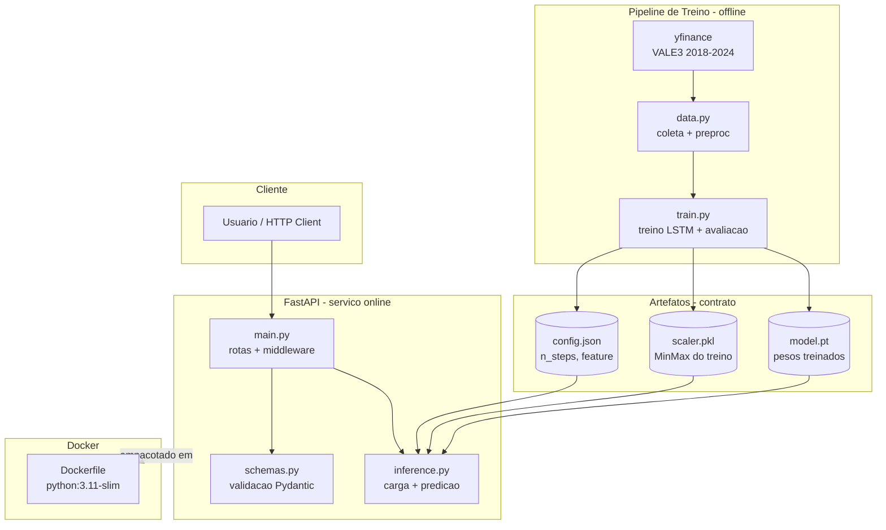
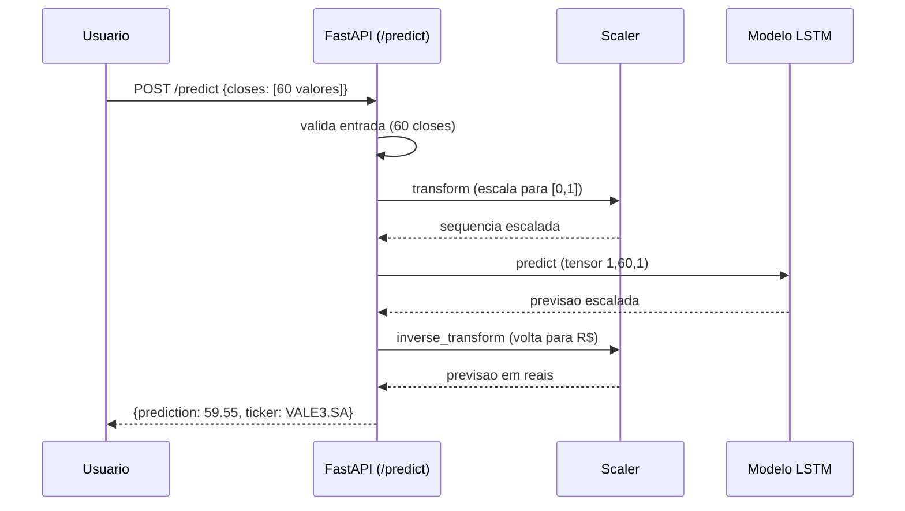

# Tech Challenge Fase 4 — Previsão de Preços com LSTM

Pipeline completo de deep learning para previsão do preço de fechamento da ação **VALE3** (B3), desde a coleta de dados até o deploy do modelo em uma API RESTful containerizada.

O projeto implementa uma rede neural **LSTM (Long Short-Term Memory)** para capturar padrões temporais na série histórica de preços, servida via **FastAPI** e empacotada com **Docker**.

---

## Arquitetura



---

## Fluxo de predição



---

## Estrutura do projeto

```
tc4-vale3/
├── src/
│   ├── data.py            # coleta (yfinance) e pre-processamento
│   ├── model.py           # definicao da classe ModeloLSTM
│   ├── train.py           # treino, avaliacao e salvamento de artefatos
│   ├── test_inference.py  # teste isolado da logica de predicao
│   └── api/
│       ├── __init__.py
│       ├── main.py        # app FastAPI, rotas e middleware de monitoramento
│       ├── inference.py   # carga dos artefatos e logica de predicao
│       └── schemas.py     # modelos Pydantic (entrada/saida)
├── artifacts/
│   ├── model.pt           # pesos do modelo treinado
│   ├── scaler.pkl         # scaler MinMax ajustado no treino
│   └── config.json        # metadados (n_steps, feature, ticker)
├── Dockerfile
├── requirements.txt
├── .dockerignore
├── .gitignore
└── README.md
```

---

## Responsabilidade dos módulos

| Módulo | Responsabilidade |
|--------|------------------|
| `data.py` | Baixa o histórico da VALE3 via yfinance; divide treino/teste cronologicamente; ajusta o scaler apenas no treino; cria as janelas deslizantes para a LSTM |
| `model.py` | Define a classe `ModeloLSTM` (camada LSTM + camada linear). Compartilhada entre treino e API |
| `train.py` | Executa o pipeline de treino, avalia com MAE/RMSE/MAPE, gera o gráfico real vs. previsto e salva os três artefatos |
| `api/schemas.py` | Define e valida o contrato de entrada (60 closes) e saída (previsão + ticker) via Pydantic |
| `api/inference.py` | Carrega os artefatos uma única vez no startup e expõe a função `prever()` que executa todo o fluxo de inferência |
| `api/main.py` | Expõe as rotas HTTP e mede o tempo de resposta de cada requisição (monitoramento) |

---

## Decisões técnicas

| Decisão | Escolha | Justificativa |
|---------|---------|---------------|
| Feature | Univariado (`Close`) | Cumpre o objetivo (prever fechamento) com o menor risco de overfitting |
| Janela (`n_steps`) | 60 pregões | ~3 meses de contexto — suficiente sem sequência longa demais |
| Arquitetura | 1 camada LSTM (50 unidades) | Empilhar não melhora em sinal univariado e aumenta overfitting |
| Normalização | MinMax `[0,1]`, ajustado só no treino | Mantém as ativações na faixa útil e evita vazamento temporal |
| Divisão treino/teste | Cronológica (80/20) | Série temporal não pode ser embaralhada — evita usar o futuro para prever o passado |
| Função de perda | MSE | Pune erros grandes, adequado a previsão de preço |
| Otimizador | Adam (`lr=0.001`) | Padrão robusto para convergência estável |

---

## Resultados

Métricas no conjunto de teste (des-normalizadas, em reais):

| Métrica | Valor |
|---------|-------|
| MAE | R$ 0,26 |
| RMSE | R$ 1,82 |
| MAPE | 0,57% |


**Leitura:** o modelo captura bem a tendência de médio prazo, mas suaviza a volatilidade diária de curto prazo. O RMSE superior ao MAE indica que os erros se concentram nos dias de maior variação. Observa-se um leve atraso na resposta — característico de previsão univariada baseada em janela histórica —, o que impõe cautela na interpretação do poder preditivo para horizontes de negociação.

---

## Como executar

### Pré-requisitos
- Python 3.11+
- Docker (para execução containerizada)

### Opção A — Local (desenvolvimento)

```bash
# ambiente virtual
python3 -m venv .venv
source .venv/bin/activate
pip install -r requirements.txt

# treinar o modelo (gera os artefatos)
cd src
python3 train.py

# subir a API
uvicorn api.main:app --reload
```

### Opção B — Docker (recomendado)

```bash
# construir a imagem
docker build -t tc4-vale3 .

# rodar o container
docker run -p 8000:8000 tc4-vale3
```

A API fica disponível em `http://localhost:8000`.

---

## Uso da API

Documentação interativa (Swagger) gerada automaticamente: **`http://localhost:8000/docs`**

### Rotas

| Método | Rota | Descrição |
|--------|------|-----------|
| `GET` | `/` | Informações da API |
| `GET` | `/health` | Health check (usado por orquestradores) |
| `POST` | `/predict` | Recebe 60 closes brutos e retorna a previsão do próximo pregão |

### Exemplo de requisição

```bash
curl -X POST "http://localhost:8000/predict" \
  -H "Content-Type: application/json" \
  -d '{"closes": [58.2, 58.5, 57.9, ... 60 valores ...]}'
```

### Resposta

```json
{
  "prediction": 59.55,
  "ticker": "VALE3.SA"
}
```

O tempo de processamento de cada requisição é registrado em log e devolvido no header `X-Process-Time-ms`.

---

## Monitoramento

Um middleware mede a latência de todas as requisições, registrando no log do servidor e expondo o valor no header `X-Process-Time-ms` de cada resposta. O endpoint `/health` permite verificação de disponibilidade por ferramentas externas.

---

## Stack

- **Modelagem:** PyTorch (LSTM)
- **Dados:** yfinance, pandas, NumPy, scikit-learn (MinMaxScaler)
- **API:** FastAPI, Pydantic, Uvicorn
- **Serialização:** joblib (scaler), state_dict (modelo)
- **Containerização:** Docker

---

## Limitações e próximos passos

- **Univariado:** o modelo usa apenas o preço de fechamento. Incluir volume, indicadores técnicos ou variáveis macroeconômicas pode reduzir o atraso da previsão.
- **Faixa de treino:** a confiabilidade cai para preços que extrapolem a faixa histórica de 2018–2024 (o scaler foi ajustado nesse período).
- **Um ticker:** o modelo e o scaler são específicos da VALE3. Outros ativos exigem novo treino.
- **Evolução possível:** prever retorno (variação percentual) em vez de preço absoluto, para forçar o modelo a aprender além da tendência trivial.

---

## Deploy

- API disponível em: 
- Vídeo apresentação disponível em: 

---

## Autores
**Adriano Cabrera**

- LinkedIn: https://www.linkedin.com/in/adriano-cabrera-b7b680a7/
- GitHub: https://github.com/cabrpin

**Caio Grazzini**

- LinkedIn: https://www.linkedin.com/in/caiograzzini/
- GitHub: https://github.com/Grazzica/

**Fabrício Batista Dias**

- LinkedIn: https://www.linkedin.com/in/fabriciobdias/
- GitHub: https://github.com/DiasFabricio

___

**Desenvolvido como parte do Tech Challenge — Pós-Graduação em Machine Learning Engineering — FIAP 2025/2026**


